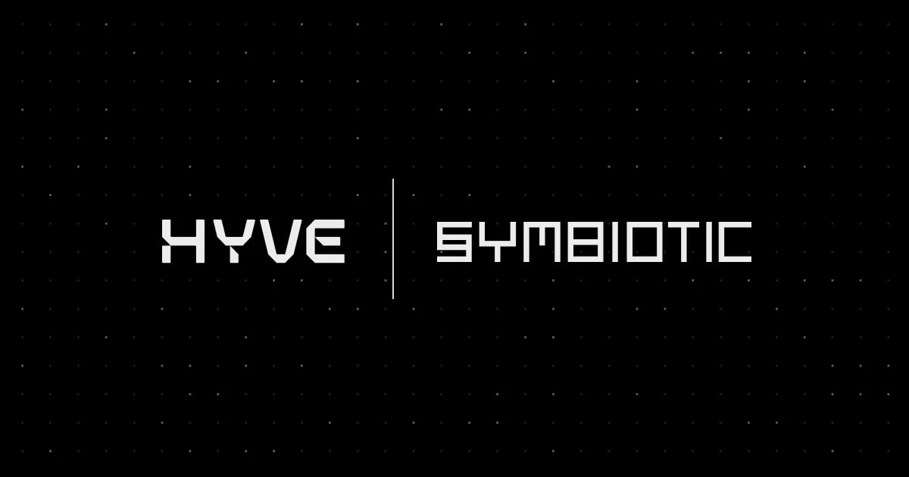

# Hyve Symbiotic Middleware

This repository provides the Hyve implementation of the Symbiotic Middleware contract for the Hyve DA protocol. By leveraging the [Symbiotic middleware SDK](https://github.com/symbioticfi/middleware-sdk), it enables secure slashing operations, key verification, and blob verification.

---

## Overview

• The core contract, `HyveMiddleware`, facilitates interactions with the Hyve DA network.  
• Slashing support is provided to ensure protocol security.  
• Verification of operators’ keys and messages is managed by helper libraries (e.g., `OperatorVerifierV1`).

---

## Deployments

Below are the current deployment addresses for the various contracts in both Sepolia and Mainnet environments.

### Sepolia

| Contract                                                                               | Address |
| -------------------------------------------------------------------------------------- | ------- |
| [`HyveMiddleware.sol`](src/HyveMiddleware.sol)                                         | -       |
| [`HyveMiddlewareReader.sol`](src/HyveMiddlewareReader.sol)                             | -       |
| [`OperatorVerifierV1.sol`](src/libraries/OperatorVerifierV1.sol)                       | -       |
| [`SlashDistributionCalculatorV1.sol`](src/libraries/SlashDistributionCalculatorV1.sol) | -       |

### Mainnet

| Contract                                                                               | Address |
| -------------------------------------------------------------------------------------- | ------- |
| [`HyveMiddleware.sol`](src/HyveMiddleware.sol)                                         | -       |
| [`HyveMiddlewareReader.sol`](src/HyveMiddlewareReader.sol)                             | -       |
| [`OperatorVerifierV1.sol`](src/libraries/OperatorVerifierV1.sol)                       | -       |
| [`SlashDistributionCalculatorV1.sol`](src/libraries/SlashDistributionCalculatorV1.sol) | -       |

---

## Epochs

Hyve operates on a 2-day epoch cycle. During each epoch:

1. Operators perform DA (Data Availability) responsibilities.
2. Stakers can add or remove their stake.
3. Once the epoch ends, the next epoch begins.

A slashing window of 2 days follows each epoch, allowing the protocol to penalize any slashable behavior that occurred during the previous epoch.

---

## Integration

### Operators

Operators must register their Hyve BLS key and P2P identity via the `registerOperator` function in the `HyveMiddleware` contract. We recommend utilizing the Hyve CLI (link forthcoming) to streamline this process. Key and identity verification logic is contained in [`OperatorVerifierV1.sol`](src/libraries/OperatorVerifierV1.sol).

### Vaults

Vaults looking to integrate with Hyve should pay attention to the following recommendations:

| Parameter      | Value                  | Comment                                                                              |
| -------------- | ---------------------- | ------------------------------------------------------------------------------------ |
| Epoch Duration | ≥ 7 days               | 4 days (slashing window + Hyve’s 2-day epoch), but 7 days is recommended for safety. |
| Burner         | `RedistributionBurner` | This burner is currently in testing.                                                 |
| Collateral     | `wstETH`               | The default collateral option.                                                       |
| Delegator Hook | `Burner`               | The default delegator hook.                                                          |

---

For further enquiries, please check the [middleware SDK documentation](https://github.com/symbioticfi/middleware-sdk) or reach out to the Hyve community.
